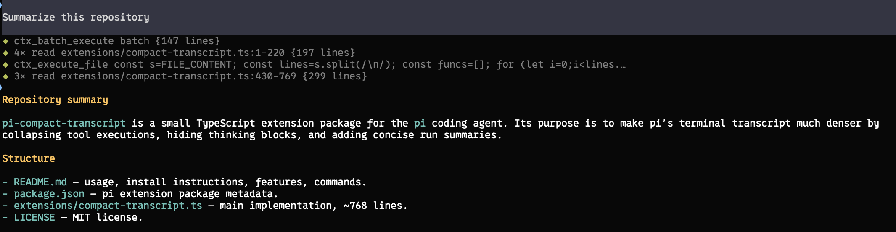

# pi-compact-transcript

A compact transcript extension for [pi](https://pi.dev).

## With the extension



## Without the extension


What it does:

- Highlights agent commentary with a success-colored left rail and a blank line before the tools below it, preserving Markdown formatting. Final answers stay unframed.
- Collapses every tool call/result into a dimmed one-line preview with a status diamond: blinking gray `◆` while running, green on success, red on failure. Failed previews retain higher-contrast text. Durations show at a second or longer.
- Consecutive uses of the same tool coalesce into a single row, e.g. `◆ 4× read src/foo.ts {12 lines · 8s}`. Edit and write previews show git-style counts such as `{+3/-1}` and `{+42/-0}` with additions in green and deletions in red; no diff content is rendered. Failed tools always get their own visible row.
- Each agent run ends with a one-line summary, e.g. `Read 6 files, edited 2, ran 3 commands, 1 failed · 42s`.
- Suppresses `Thinking...` markers when thinking is hidden.
- Works with custom/external tools from other extensions; unknown tools preview their most meaningful string argument (command, code, query, path, url, ...) instead of raw JSON.
- Expanded tool output still uses pi's original renderer, so pi's normal tool expansion works when details matter.

## Install

```bash
pi install npm:pi-compact-transcript
```

Or from GitHub:

```bash
pi install git:github.com/avhagedorn/pi-compact-transcript
```

Or try it for one run:

```bash
pi -e git:github.com/avhagedorn/pi-compact-transcript
```

Reload or restart pi after installing:

```text
/reload
```

## Recommended settings

Works best with hidden thinking and no output padding — set in `~/.pi/agent/settings.json` or via `/settings`:

```json
{
  "hideThinkingBlock": true,
  "outputPad": 0
}
```

Thinking suppression only applies when `hideThinkingBlock` is on; with it off, pi renders thinking traces normally. Commentary styling works with either setting. A message is identified as commentary once it contains a tool call, so streaming text stays unframed until that tool call arrives.

## Default configuration

The default can be overridden without editing the extension source:

- User-wide: `~/.pi/agent/compact-transcript.json`
- Trusted project: `<project>/.pi/compact-transcript.json`

Example:

```json
{
  "enabled": false
}
```

Configuration is resolved in this order (highest priority first): current-session `/compact-transcript on|off`, trusted project configuration, user-wide configuration, then the built-in default (`enabled: true`). Project configuration is ignored unless Pi reports the project as trusted. Missing files, invalid JSON, and unsupported values are ignored and the next fallback is used. Session toggles remain stored in the existing session entries, and legacy mode values remain supported.

## Commands

```text
/compact-transcript          # toggle on/off
/compact-transcript on|off   # set explicitly
/compact-transcript status   # show current state
```

Toggling re-renders the visible transcript immediately — no reload needed. Write stats are always shown for completed writes. Pre-0.5 mode names (`balanced`, `aggressive`, `debug`, `disabled`) are accepted as legacy aliases for `on`/`off`.

## Notes

This extension changes display only — tool execution is still handled by pi and any other extensions that registered or override tools.

Compact rendering uses pi's public exported TUI components where available. Burst compaction and thinking suppression rely on pi's current TUI internals; if a future pi release changes those, the affected rows fall back to pi's normal rendering.
